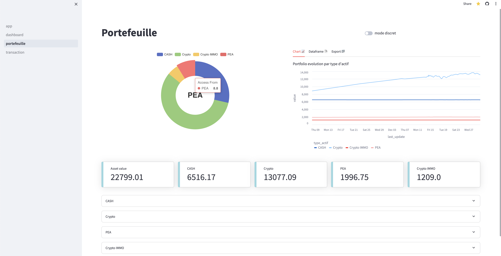
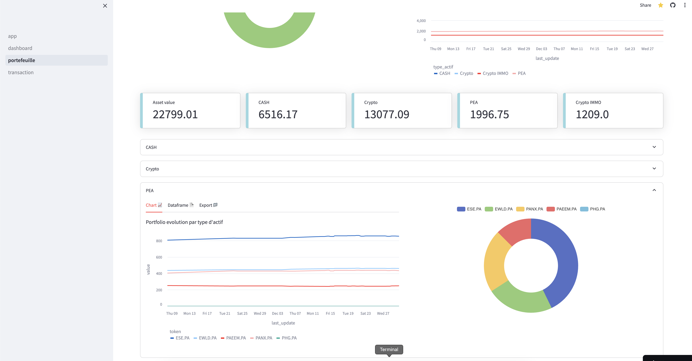

# Suivi Portefeuille

Suivi Portefeuille is a web application for managing and tracking your portfolio. It is built with Python, JavaScript, and uses the Streamlit framework for the frontend.

## Pipelines


## Features

- User authentication: Register (only available for me) and log in to access the dashboard.
- Portfolio overview: Get a summary of your portfolio state per type.
- Transactions: Record and delete your transaction.
- Dashboard: Under development => I will add some performance visualization + a market analysis.

## Roadmap to follow

- connect to api to get historical data from diferent market
- create feature to compare your portfolio to a benchmark
- create feature to evaluate perf of an asset
- develop algorithm to detect trendings assets
- create a dashboard to visualize the performance of your portfolio
- create a dashboard to rank assets by performance

## Les dashboards

# 
# 


## Installation

1. Clone the repository:
```bash
git clone https://github.com/TheoCostes/PortfolioViewApp.git
```

2. Install the required packages:
```bash
pip install -r requirements.txt
```

3. Run the application:
```bash
streamlit run app.py
```

## Usage

After running the application, navigate to the provided local URL in your web browser. Register or log in to access the dashboard.  

## Contributing
Pull requests are welcome. For major changes, please open an issue first to discuss what you would like to change.

